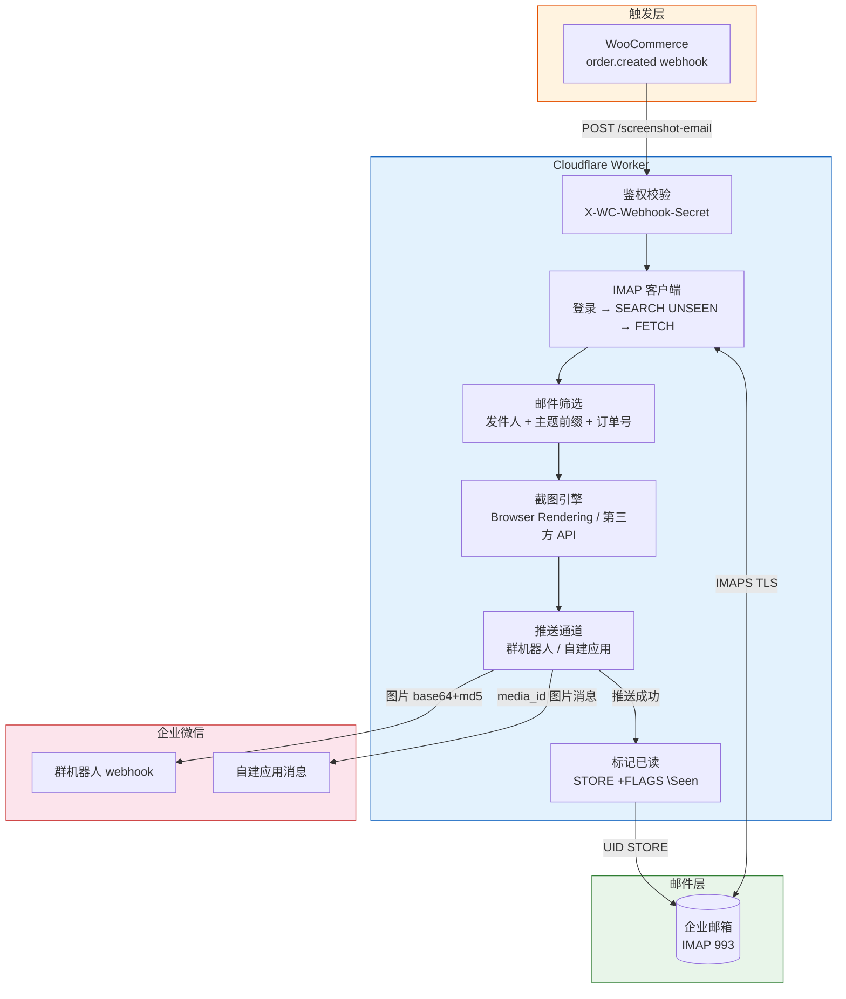
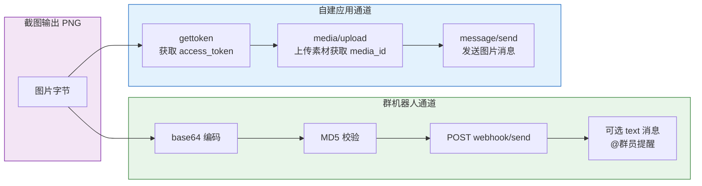
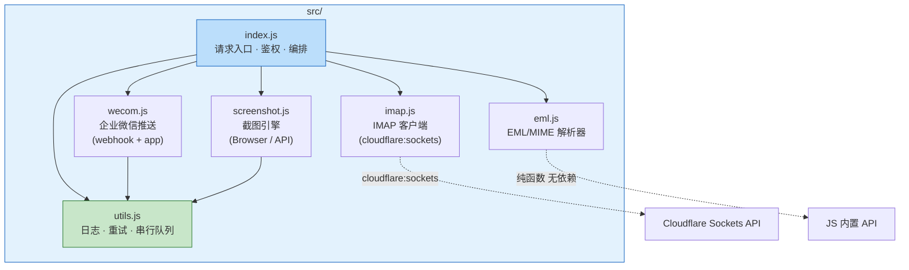

<div align="center">

# 📸 wc-mail-shot

**WooCommerce → Mail → Screenshot → WeChat Work**

Cloudflare Worker 应用 · 接收 WooCommerce 订单 webhook，通过 IMAP 读取未读邮件，渲染截图后推送到企业微信群

[](http://www.wtfpl.net/)
[](https://workers.cloudflare.com/)
[](https://work.weixin.qq.com/)

</div>

---

## ✨ 功能特性

| 特性 | 说明 |
|------|------|
| 📧 IMAP 邮件读取 | 通过 IMAP 协议读取企业邮箱未读邮件，推送成功后自动标记已读，天然去重 |
| 🖼️ 双截图引擎 | 支持 Cloudflare Browser Rendering 和第三方截图 API（多 key 轮询 + 故障自动转移），可自由切换 |
| 📱 双推送通道 | 群机器人 webhook 和自建应用消息，可同时启用或任选其一 |
| ⚡ 并发处理 | 多封邮件并发截图推送，通过 `MAX_CONCURRENT_EMAILS` 可配置 |
| 🔁 自动重试 | 截图和推送失败自动重试（指数退避），可配置重试次数 |
| 🎯 精准过滤 | 支持按发件人、主题前缀过滤，只处理符合条件的邮件 |
| 📋 WooCommerce 集成 | 开箱即用的 webhook 对接，支持订单号自动匹配 |

## 📋 系统架构



## 🔄 工作流程

```mermaid
flowchart TD
    A[WooCommerce 订单创建] --> B{收到 webhook<br/>POST /screenshot-email}
    B --> C[校验 X-WC-Webhook-Secret]
    C -->|失败| C1[401 Unauthorized]
    C -->|通过| D[IMAP 登录邮箱]

    D --> E[UID SEARCH UNSEEN<br/>拉取全部未读邮件]
    E --> F{是否有未读邮件?}
    F -->|否| F1[404 没有未读邮件]
    F -->|是| G[逐封 FETCH BODY.PEEK[]<br/>不改变已读状态]

    G --> H[解析 EML<br/>提取主题/发件人/正文]
    H --> I{发件人 + 主题前缀<br/>+ 订单号匹配?}
    I -->|不匹配| I1[跳过该邮件]
    I -->|匹配| J[并发处理<br/>max: MAX_CONCURRENT_EMAILS]

    J --> K[渲染 HTML → PNG 截图]
    K -->|失败| K1[重试 2 次<br/>指数退避 1s → 2s]
    K1 -->|仍失败| K2[该邮件保持未读<br/>下次请求重试]
    K -->|成功| L[推送到已启用通道]

    L --> M{推送成功?}
    M -->|成功| N[标记已读<br/>UID STORE +FLAGS \Seen]
    M -->|失败| M1[重试 2 次<br/>指数退避]
    M1 -->|仍失败| M2[邮件保持未读]
    N --> O[返回结果 JSON]

    style A fill:#fff3e0,stroke:#e65100
    style J fill:#e3f2fd,stroke:#1565c0
    style K fill:#f3e5f5,stroke:#7b1fa2
    style N fill:#e8f5e9,stroke:#2e7d32
    style C1 fill:#ffebee,stroke:#c62828
    style F1 fill:#ffebee,stroke:#c62828
    style K2 fill:#ffebee,stroke:#c62828
    style M2 fill:#ffebee,stroke:#c62828
```

## 📱 推送通道对比



| 通道 | 推送方式 | 启用条件 | @群员 | 图片限制 | 频率限制 |
|------|---------|---------|-------|---------|---------|
| 群机器人 webhook | 图片消息（base64 + md5） | `WEBHOOK_KEY` 非空 | 追加 text 消息 | ≤2MB，JPG/PNG | 20 条/分钟 |
| 自建应用消息 | 上传素材 → 发送图片消息 | `WECOM_CORP_ID` + `WECOM_AGENT_ID` | 通过 `touser` 指定 | ≤10MB，JPG/PNG | 30 次/分钟/人 |

## 🚀 快速开始

### 前置条件

- [Cloudflare Workers **付费版**](https://developers.cloudflare.com/workers/)（Browser Rendering 需要）
- 企业邮箱已开启 IMAP 服务
- 至少一个推送通道的凭证

### 部署步骤

```bash
# 1. 安装依赖
mise exec -- npm install

# 2. 登录 Cloudflare
mise exec -- npx wrangler login

# 3. 编辑 wrangler.toml 填入非敏感配置（见下方配置表）

# 4. 设置敏感信息
mise exec -- npx wrangler secret put IMAP_PASSWORD       # 邮箱密码
mise exec -- npx wrangler secret put WECOM_CORP_SECRET   # 自建应用 secret（仅应用通道）
mise exec -- npx wrangler secret put AUTH_TOKEN          # 接口鉴权 token

# 5. 部署
mise exec -- npx wrangler deploy
```

## ⚙️ 配置说明

### 环境变量（`wrangler.toml` 的 `[vars]`）

| 变量 | 默认值 | 说明 |
|------|--------|------|
| `IMAP_HOST` | `imap.exmail.qq.com` | 邮箱 IMAP 服务器地址 |
| `IMAP_PORT` | `993` | IMAPS 端口 |
| `IMAP_USER` | — | 收信邮箱地址（登录账号） |
| `WEBHOOK_KEY` | — | 群机器人 webhook key；**非空即启用** |
| `WECOM_CORP_ID` | — | 自建应用 corpid；**与 AGENT_ID 同时填写即启用** |
| `WECOM_AGENT_ID` | — | 自建应用 agentid |
| `WECOM_TOUSER` | `@all` | 应用消息接收人（userid 用 `\|` 分隔） |
| `SCREENSHOT_MODE` | `browser` | 截图模式：`browser` \| `api` |
| `SCREENSHOT_API_URL` | — | 第三方 API 模板（含 `{key}` 和 `{html}` 占位符） |
| `SCREENSHOT_API_KEYS` | — | 第三方 API key 列表（逗号分隔，故障自动转移） |
| `MAX_CONCURRENT_EMAILS` | `3` | 并发处理邮件数（建议 2-5） |
| `LOG_LEVEL` | `info` | 日志级别：`error` \| `warn` \| `info` \| `debug` |
| `MAIL_FROM_FILTER` | — | 发件人过滤（完整邮箱或域名后缀，逗号分隔） |
| `MAIL_SUBJECT_PREFIX` | — | 主题前缀过滤（逗号分隔） |
| `MENTIONED_LIST` | — | 群机器人 @userid 列表（逗号分隔） |
| `MENTIONED_MOBILE_LIST` | — | 群机器人 @手机号列表（逗号分隔） |

### 敏感信息（`wrangler secret put`）

| Secret | 用途 |
|--------|------|
| `IMAP_PASSWORD` | 邮箱密码或客户端专用密码 |
| `WECOM_CORP_SECRET` | 自建应用 secret |
| `AUTH_TOKEN` | 接口鉴权 token |

## 🔌 WooCommerce webhook 配置

WooCommerce → 设置 → 高级 → Webhooks → 添加 webhook：

| 字段 | 值 |
|------|-----|
| 主题 | 订单已创建（Order created） |
| Delivery URL | `https://<worker>.workers.dev/screenshot-email` |
| Secret | 与 `AUTH_TOKEN` 相同 |
| API 版本 | WP REST API v3 |

## 🧪 手动测试

```bash
curl -X POST https://<worker>.workers.dev/screenshot-email \
  -H "Content-Type: application/json" \
  -H "X-WC-Webhook-Secret: <AUTH_TOKEN>" \
  --data-binary @test/sample-order.json
```

### 请求体字段（均可选）

| 字段 | 说明 |
|------|------|
| `id` / `number` | WooCommerce 订单号，用于匹配邮件主题 |
| `uid` | 直接指定邮件 UID，跳过自动匹配 |
| `mail_from_filter` | 覆盖默认发件人过滤 |
| `mail_subject_prefix` | 覆盖默认主题前缀过滤 |
| `mentioned_list` | 覆盖群机器人 @userid 列表 |
| `mentioned_mobile_list` | 覆盖群机器人 @手机号列表 |
| `app_touser` | 覆盖自建应用消息接收人 |

## 📐 模块架构



| 文件 | 行数 | 职责 |
|------|------|------|
| `index.js` | 240 | 请求入口：鉴权 → IMAP → 截图 → 推送 → 标记已读 |
| `imap.js` | 218 | IMAP 客户端（`cloudflare:sockets`，RFC 3501 子集） |
| `eml.js` | 159 | EML/MIME 解析器（主题/发件人/正文提取） |
| `screenshot.js` | 129 | 截图引擎（Browser Rendering \| 第三方 API） |
| `wecom.js` | 155 | 企业微信推送（群机器人 + 自建应用） |
| `utils.js` | 79 | 公共工具（日志/重试/串行队列/响应封装） |

## ⚠️ 限制与说明

- 只处理**未读**邮件，推送成功即标记已读，天然去重
- 一封邮件须**全部启用通道都成功**才标记已读，任一失败则保持未读
- 群机器人图片：仅 JPG/PNG，≤2MB（超限自动降采样）
- 群机器人频率：20 条/分钟；自建应用：30 次/分钟/人
- 单次请求最多处理 8 封邮件，自动匹配扫描最近 30 封未读邮件
- 截图和推送失败自动重试（指数退避，默认 2 次）
- 第三方截图 API 单次请求超时 15 秒

## 📚 相关文档

- [群机器人发送消息](https://developer.work.weixin.qq.com/document/path/91770)
- [自建应用发送消息](https://developer.work.weixin.qq.com/document/path/90236)
- [上传临时素材](https://developer.work.weixin.qq.com/document/path/90253)
- [Cloudflare Browser Rendering](https://developers.cloudflare.com/browser-rendering/)
- [Cloudflare Sockets API](https://developers.cloudflare.com/workers/runtime-apis/tcp-sockets/)

## 📄 许可

本项目采用 [WTFPL](http://www.wtfpl.net/)（Do What The Fuck You Want To Public License）开源协议。

你可以对代码做任何你想做的事情——使用、修改、分发、商用，无需任何限制。详见 [LICENSE](./LICENSE) 文件。
